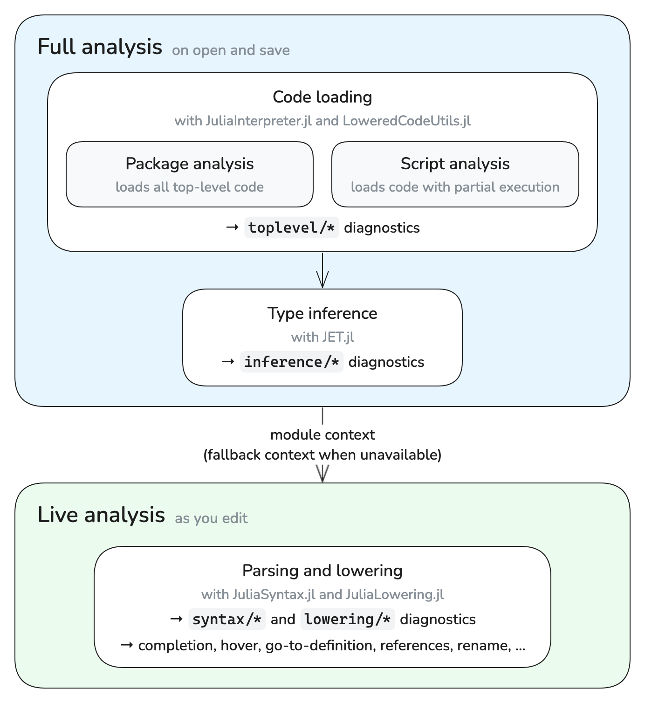
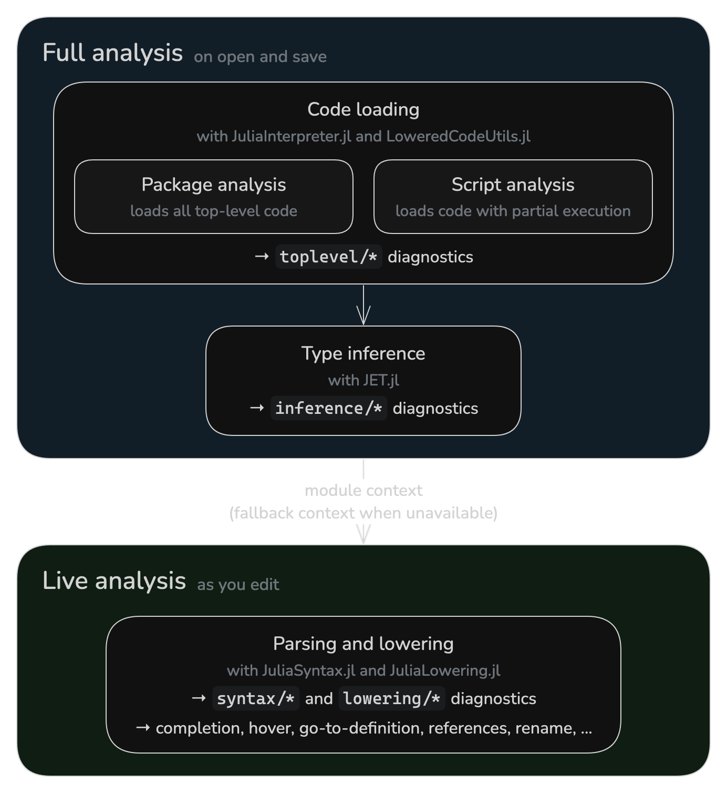

# [Analysis](@id analysis)

JETLS analyzes your code in two layers:

- **Full analysis** runs when you open or save a file. It loads your code,
  either as a package or as a script, and runs type inference on it, reporting
  `toplevel/*` and `inference/*` diagnostics.
- **Live analysis** runs as you edit. It parses and lowers each file,
  reporting `syntax/*` and `lowering/*` diagnostics, and powers language
  features such as completion and go-to-definition.

The two layers are connected by the module context: full analysis records the
module each part of a file is evaluated in, and live analysis uses it to
resolve the macros and global names that the file refers to. The following
diagram summarizes this structure:

```@raw html
<div class="display-light-only" style="max-width: 692px; margin: 0 auto;">
```

```@raw html
</div>
<div class="display-dark-only" style="max-width: 692px; margin: 0 auto;">
```

```@raw html
</div>
```

[Full analysis](@ref analysis/full) describes how JETLS loads your code and
which files it covers. [Live analysis](@ref analysis/live) describes how live
analysis depends on full analysis, including what remains available for files
that full analysis does not cover.

## [Full analysis](@id analysis/full)

Full analysis consists of two steps:

- Code loading:
  [JuliaInterpreter.jl](https://github.com/JuliaDebug/JuliaInterpreter.jl)
  interprets the top-level code to load your code, while
  [LoweredCodeUtils.jl](https://github.com/JuliaDebug/LoweredCodeUtils.jl)
  selects the code to execute in [script analysis](@ref analysis/full/modes/script).
  Loading stops at the first [top-level error](@ref diagnostic/reference/toplevel/error),
  and code after it is not analyzed.
  This step reports [`toplevel/*` diagnostics](@ref diagnostic/reference/toplevel).
- Type inference: [JET.jl](https://github.com/aviatesk/JET.jl) analyzes the
  loaded code based on Julia's type inference and reports [`inference/*` diagnostics](@ref diagnostic/reference/inference).

Both kinds of diagnostics are delivered through the
[`JETLS/save`](@ref diagnostic/source) source.

Full analysis works on analysis units. Each unit starts from an entry file,
such as the entry file of a package or a script, and covers the entry file and
every file reachable from it through `include`.

!!! danger "Security"
    Full analysis runs your top-level code and the dependency packages it
    loads, both of which can execute arbitrary code. Live analysis can also
    execute macro code during macro expansion. Neither layer is a sandbox;
    do not run JETLS on code you do not trust.

### [Full analysis modes](@id analysis/full/modes)

Full analysis loads an analysis unit in one of two ways. In both, the
dependency packages your code loads are loaded unconditionally. The comments
in the following example show which top-level code each mode executes:

```julia
using Statistics          # package: executed, script: executed
data = rand(10)           # package: executed, script: not executed
struct Point              # package: executed, script: executed
    x::Float64
end
norm2(p::Point) = p.x^2   # package: executed, script: executed
println(mean(data))       # package: executed, script: not executed
```

#### [Package analysis](@id analysis/full/modes/package)

Package analysis executes all top-level code of a package unconditionally,
then runs type inference on the loaded code. In the example above, it also
runs `println(mean(data))`, so an error in such code is reported as
[`toplevel/error`](@ref diagnostic/reference/toplevel/error).

#### [Script analysis](@id analysis/full/modes/script)

Script analysis loads a script with partial execution: it executes only the
top-level code needed to load definitions such as types, methods, and macros,
and runs type inference on the rest without running it. In the example above,
it defines `Point` and `norm2` but only infers `data = rand(10)` and
`println(mean(data))`, so an error in such code is reported as an
[`inference/*` diagnostic](@ref diagnostic/reference/inference).

Since script analysis does not execute such assignments, a definition that
needs the value of the assigned binding cannot be loaded unless that value
can be inferred. Otherwise, JETLS reports
[`toplevel/missing-concretization`](@ref diagnostic/reference/toplevel/missing-concretization):

```julia
read_config() = Base.get_bool_env("USE_FLOAT64", true; throw=true)
data = rand(read_config() ? Float64 : Float32, 10)
struct Samples
    values::typeof(data)  # toplevel/missing-concretization
end
```

See [`[full_analysis] concretization_patterns`](@ref config/full_analysis/concretization_patterns)
for how to let JETLS evaluate such bindings.

### [How each file is analyzed](@id analysis/full/files)

JETLS decides which analysis unit a file belongs to, and whether the unit is
loaded with [package analysis](@ref analysis/full/modes/package) or
[script analysis](@ref analysis/full/modes/script), based on the nearest
`Project.toml` found by searching upward from the file's directory, and on the
file's location relative to it:

| File                                  | Entry file         | Analysis mode                                        | Environment                           |
| :------------------------------------ | :----------------- | :--------------------------------------------------- | :------------------------------------ |
| Package source file (under `src/`)    | `src/<name>.jl`    | [Package analysis](@ref analysis/full/modes/package) | The package environment               |
| Package test file (under `test/`)     | `test/runtests.jl` | [Script analysis](@ref analysis/full/modes/script)   | The package environment               |
| Package extension file (under `ext/`) | —                  | No full analysis                                     | —                                     |
| Other file in an environment          | The opened file    | [Script analysis](@ref analysis/full/modes/script)   | The environment of the `Project.toml` |
| File without a `Project.toml`         | The opened file    | [Script analysis](@ref analysis/full/modes/script)   | No project (the default environment)  |

Here, a package is an environment whose `Project.toml` has a `name` entry, and
the package rows apply to the directories next to that `Project.toml`. In
addition:

- For package extension files, JETLS reports
  [`toplevel/analysis-skipped`](@ref diagnostic/reference/toplevel/analysis-skipped)
  (see [Files without full analysis](@ref analysis/live/fallback)).
- Other files in an environment include files in a package outside `src/`,
  `test/`, and `ext/`, and files in an environment whose `Project.toml` has no
  `name` entry.
- A standalone script is analyzed together with the files it includes.
  Opening a standalone script that no earlier analysis covers makes it the
  entry file of a new unit. For example, if `scripts/main.jl` includes
  `scripts/utils.jl`, opening `scripts/main.jl` analyzes both files together,
  while opening `scripts/utils.jl` first analyzes it alone, without what
  `scripts/main.jl` defines before including it.
- A file without a `Project.toml` is analyzed as `julia script.jl` would run
  it: dependency packages are loaded from the default environment (e.g.
  `@v1.13`) and the standard library.

Some documents are handled differently:

| Document                                    | Entry file      | Analysis mode                                      | Environment                           |
| :------------------------------------------ | :-------------- | :------------------------------------------------- | :------------------------------------ |
| Unsaved (untitled) buffer[^unsaved_buffers] | The buffer      | [Script analysis](@ref analysis/full/modes/script) | The environment of the workspace root |
| Notebook                                    | The notebook    | [Script analysis](@ref analysis/full/modes/script) | The environment of the notebook file  |
| File outside the workspace root             | —               | No full analysis                                   | —                                     |
| File opened without a workspace folder      | The opened file | [Script analysis](@ref analysis/full/modes/script) | No project (the default environment)  |

A notebook is analyzed with all its cells as a single script (see
[Notebook support](@ref notebook)). For files outside the workspace root, see
[Files without full analysis](@ref analysis/live/fallback).

[^unsaved_buffers]:
    How unsaved buffers are represented depends on the client. JETLS supports
    unsaved buffers with the following URI schemes:
    - `untitled:` (VSCode and VSCode-based editors)
    - `buffer:` (Sublime Text)

[`jetls check`](@ref cli-check) analyzes files in the same way, except that it
also analyzes files outside the root path (see
[Input paths and analysis mode](@ref cli-check/input)).

### [When full analysis runs](@id analysis/full/timing)

Full analysis works on whole units. JETLS requests it in the following cases:

- When you open a file that no full analysis covers yet. Opening a file that
  an earlier analysis already covers, e.g. another file of an analyzed
  package, reuses that result.
- When you save a file. JETLS schedules reanalysis of the unit the file belongs
  to, such as the entire package for a package source file. Saves are debounced
  per unit: JETLS waits for
  [`[full_analysis] debounce`](@ref config/full_analysis/debounce) seconds
  without another save in that unit before queuing the request.
- For unsaved buffers, which are never saved, after each edit, with a fixed
  debounce of 3 seconds.
- For notebooks, when the notebook is opened and when it is saved.
- When [`[full_analysis] concretization_patterns`](@ref config/full_analysis/concretization_patterns)
  or [`[full_analysis] concretization_timeout`](@ref config/full_analysis/concretization_timeout)
  changes, for every unit that has been analyzed.

Reanalysis is skipped if any previously analyzed file in the unit has a saved
syntax error. This can prevent full-analysis diagnostics from updating even
when you save another, syntactically valid file in the same unit. Fix the
syntax errors and save the affected files to allow full analysis to run again.

The first full analysis in a package environment may require the environment
to be instantiated. See
[`[full_analysis] auto_instantiate`](@ref config/full_analysis/auto_instantiate)
for how JETLS handles that.

### [Excluding files from full analysis](@id analysis/full/exclude)

The [`analysis_overrides`](@ref init-options/analysis_overrides)
initialization option excludes the matched files from full analysis:

```toml
[[initialization_options.analysis_overrides]]
path = "test/fixtures/**"
```

Excluded files are handled as described in
[Files without full analysis](@ref analysis/live/fallback).

!!! warning
    `analysis_overrides` is provided as a temporary workaround and may be
    removed or changed at any time.

## [Live analysis](@id analysis/live)

Live analysis parses and lowers your code with
[JuliaSyntax.jl](https://github.com/JuliaLang/julia/tree/master/JuliaSyntax)
and [JuliaLowering.jl](https://github.com/JuliaLang/julia/tree/master/JuliaLowering),
without loading the file as a package or script. Macro expansion can still
execute macro code. Live analysis reports
[`syntax/*`](@ref diagnostic/reference/syntax) and
[`lowering/*`](@ref diagnostic/reference/lowering) diagnostics, delivered
through the [`JETLS/live`](@ref diagnostic/source) source, and powers most
language features, such as completion, hover, go-to-definition, references, and
rename.

Live analysis runs whenever the contents of an open file change. It also
analyzes files you have not opened, as long as full analysis covers them, e.g.
the other files of a package once you open one of them (see
[`[diagnostic] all_files`](@ref config/diagnostic/all_files)).

Since live analysis takes the module context from full analysis, some of its
results depend on full analysis: the `lowering/*` diagnostics that depend on
the module context, such as
[`lowering/undef-global-var`](@ref diagnostic/reference/lowering/undef-global-var),
are reported only once full analysis has established the module context of the
file. JETLS then refreshes the live diagnostics to include them, so they appear
without further edits. Global names are likewise resolved against the
definitions that full analysis has loaded, except that completion of global
names also offers the global names defined by the current contents of files in
in the same analysis unit. Hover and type inlay hints also run type inference
on the current top-level form on demand in that context.

### [Files without full analysis](@id analysis/live/fallback)

Full analysis does not cover the following files:

- Files outside the workspace root, such as the source of a dependency opened
  through go-to-definition
- Package extension files (see
  [How each file is analyzed](@ref analysis/full/files))
- Files that are not reachable through `include` from the entry file of any
  analysis unit, such as a file under `src/` that the package does not include
- Files excluded with [`analysis_overrides`](@ref init-options/analysis_overrides)
- Any file until its first full analysis completes

For these files, live analysis uses a fallback module context in place of the
one full analysis would establish. The fallback context provides the names of
`Base` and of the `Test` standard library, but none of the names the file itself
imports. As a result:

- [`syntax/*` diagnostics](@ref diagnostic/reference/syntax) and the
  `lowering/*` diagnostics that do not depend on the module context, such as
  unused or undefined local variables and unreachable code, are reported as
  usual.
- The `lowering/*` diagnostics that depend on the module context, such as
  [`lowering/undef-global-var`](@ref diagnostic/reference/lowering/undef-global-var),
  [`lowering/unused-import`](@ref diagnostic/reference/lowering/unused-import),
  and [`lowering/macro-expansion-error`](@ref diagnostic/reference/lowering/macro-expansion-error),
  are not reported. Neither are `toplevel/*` and `inference/*` diagnostics,
  which come from full analysis.
- Go-to-definition, references, and rename keep working for local variables,
  including inside `@testset` and other macros available in the fallback
  context. The arguments of other macro calls are analyzed approximately, as
  if they were written without the macro. For global names, these features
  only consider the file itself.
- Completion of global names offers the names available in the fallback context
  and the global names that the file itself defines.
- Hover and type inlay hints may give incomplete results.
