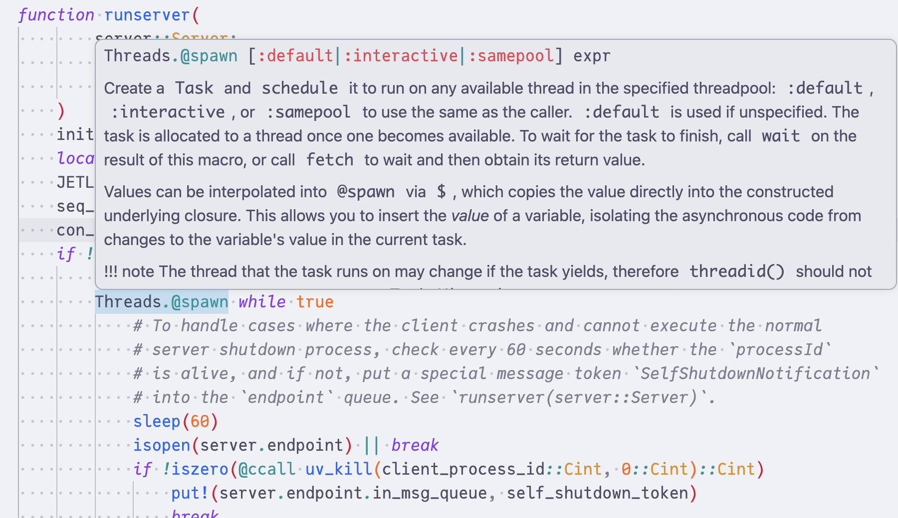
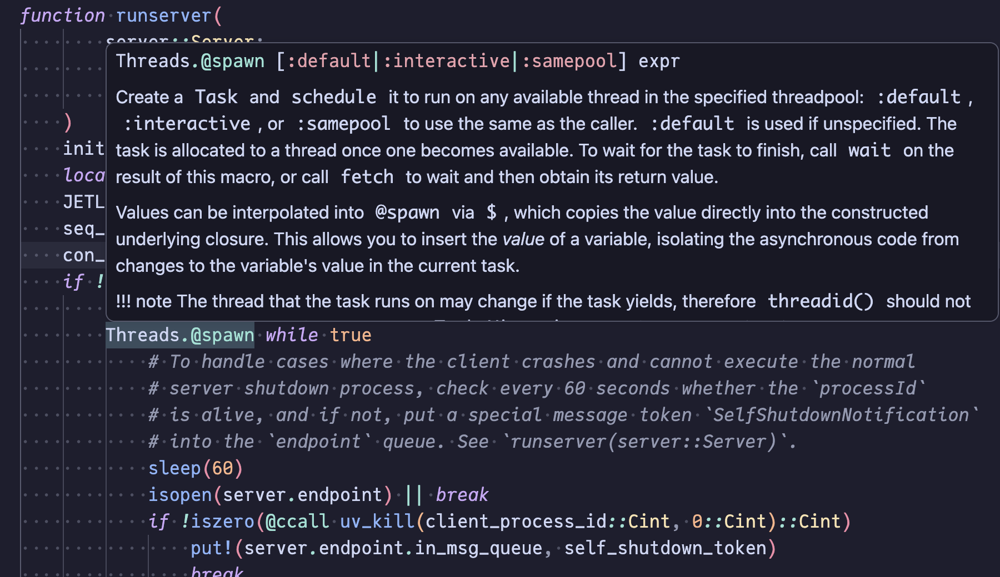
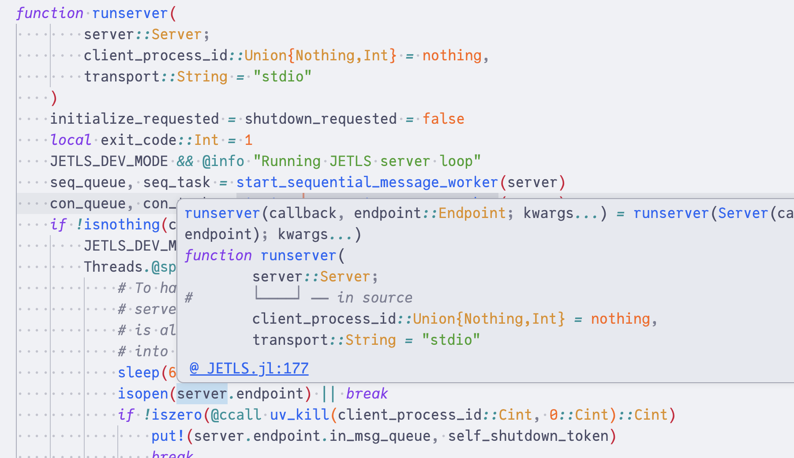
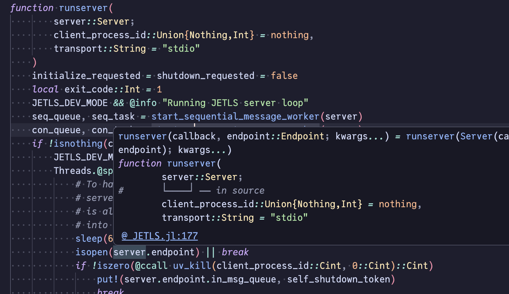

# [Features](@id features)

This page provides an overview of the language server features that JETLS
offers.

Screenshots on this page use VSCode (via the
[`jetls-client`](@ref index/editor-setup/vscode) extension), as its LSP UI
is the de facto reference. The same features work in any
[supported editor](@ref index/editor-setup), though the presentation may
differ.[^error_lens]

[^error_lens]:
    Some screenshots show diagnostic messages rendered inline next to
    the affected line. This presentation is provided by the
    [Error Lens](https://marketplace.visualstudio.com/items?itemName=usernamehw.errorlens)
    VSCode extension, not by JETLS itself — JETLS reports the diagnostic
    information through standard LSP channels, and the inline rendering
    is up to the client.

!!! note
    JETLS is under active development. This page is not exhaustive and is
    updated as features mature. For the current status of planned features,
    see the [roadmap](https://publish.obsidian.md/jetls/work/JETLS/JETLS+roadmap).

#### [Overview](@id features/overview)

```@contents
Pages = ["features.md"]
Depth = 2:3
```

## [Diagnostic](@id features/diagnostic)

JETLS reports diagnostics from three analysis stages — syntax parsing,
lowering, and type inference — covering everything from malformed input
to deep type-level issues. Some diagnostics come with quick-fix
[code actions](@ref features/code-actions). See the
[Diagnostic](@ref diagnostic) reference for the full list of diagnostic
codes and examples.

### [Syntax diagnostics](@id features/diagnostic/syntax)

Parse errors detected by
[JuliaSyntax.jl](https://github.com/JuliaLang/JuliaSyntax.jl).

```@raw html
<div class="display-light-only">
  
</div>
<div class="display-dark-only">
  
</div>
```

### [Lowering diagnostics](@id features/diagnostic/lowering)

Static analysis issues produced during lowering by
[JuliaLowering.jl](https://github.com/JuliaLang/julia/tree/master/JuliaLowering) —
including undefined / unused bindings, unreachable code, scope
ambiguities, and import-related issues.

```@raw html
<div class="display-light-only">
  
</div>
<div class="display-dark-only">
  
</div>
```

### [Inference diagnostics](@id features/diagnostic/inference)

Type-level issues caught by [JET.jl](https://github.com/aviatesk/JET.jl)
during type inference, such as non-existent field access, out-of-bounds
indexing, method errors, and non-boolean conditions.

```@raw html
<div class="display-light-only">
  
</div>
<div class="display-dark-only">
  
</div>
```

## [Completion](@id features/completion)

JETLS provides type-aware code completion with multiple modes.

### [Global and local completion](@id features/completion/global-local)

Completion for global symbols (functions, types, modules, constants) and
local bindings. Global completion items include detailed kind information
resolved lazily when a candidate is selected.

```@raw html
<div class="display-light-only">
  
</div>
<div class="display-dark-only">
  
</div>
```

### [Method signature completion](@id features/completion/method-signature)

Triggered inside a function call (after `(`, `,`, or space). Compatible
method signatures are suggested based on already-provided arguments.
Selecting a candidate inserts remaining positional arguments as snippet
placeholders with type annotations. Inferred return type and documentation
are resolved lazily.

See [`[completion.method_signature] prepend_inference_result`](@ref
config/completion/method_signature/prepend_inference_result) for the
configuration option that shows the inferred return type inline.

```@raw html
<div class="display-light-only">
  
</div>
<div class="display-dark-only">
  
</div>
```

### [Keyword argument completion](@id features/completion/keyword-argument)

Triggered inside a function call at the keyword argument position
(e.g. `func(; |)` or `func(k|)`). Available keyword arguments are suggested
with `=` appended. Already-specified keywords are excluded.

```@raw html
<div class="display-light-only">
  
</div>
<div class="display-dark-only">
  
</div>
```

### [LaTeX and emoji completion](@id features/completion/latex-emoji)

Type `\` to trigger LaTeX symbol completion (e.g. `\alpha` → `α`) or `\:`
to trigger emoji completion (e.g. `\:smile:` → `😄`), mirroring the Julia
REPL.

```@raw html
<table>
  <thead>
    <tr><th>Trigger</th><th>Example</th></tr>
  </thead>
  <tbody>
    <tr>
      <td>LaTeX symbol (<code>\</code>)</td>
      <td>
        <div class="display-light-only">
          
        </div>
        <div class="display-dark-only">
          
        </div>
      </td>
    </tr>
    <tr>
      <td>Emoji (<code>\:</code>)</td>
      <td>
        <div class="display-light-only">
          
        </div>
        <div class="display-dark-only">
          
        </div>
      </td>
    </tr>
  </tbody>
</table>
```

## [Signature help](@id features/signature-help)

Method signatures are displayed as you type function arguments. Methods are
filtered based on the inferred types of already-provided arguments — e.g.,
typing `sin(1,` shows only methods compatible with an `Int` first argument.

```@raw html
<div class="display-light-only">
  
</div>
<div class="display-dark-only">
  
</div>
```

## [Go to definition](@id features/go-to-definition)

Jump to where a symbol is defined. JETLS resolves method and module
definitions, as well as local bindings.

```@raw html
<div class="display-light-only">
  
</div>
<div class="display-dark-only">
  
</div>
```

JETLS also implements go to declaration (`textDocument/declaration`),
which jumps to declaration sites (e.g., `import`/`using`, `local x`, or
empty `function foo end`) when distinct from the definition, and falls
back to go to definition otherwise.

## [Go to type definition](@id features/go-to-type-definition)

Jump to the definition of an expression's *type* rather than the expression
itself, e.g. with the cursor on a binding of type `Foo`, JETLS navigates to the
`struct Foo` definition; for a `Vector{Int}`-typed value, it lands on `Vector`'s
definition.

```@raw html
<div class="display-light-only">
  
</div>
<div class="display-dark-only">
  
</div>
```

The cursor can be on:

- An identifier (local binding, parameter, type name, etc.). The
  inferred type at that position is resolved.
- A dot-chain expression (`Base.Pa│ir`). The full chain is treated as
  the target.
- A call expression. Placing the cursor right after `)` (e.g.
  `sin(1.0)│`) resolves to the call's return type. `do`-block calls
  work the same way — `func() do ... end│` resolves to the call's
  return type.

For `Union` types, one location is returned per constituent.

## [Document link](@id features/document-link)

Path strings inside `include("...")` and `include_dependency("...")`
calls become clickable links that open the referenced file. The path
must be a single non-interpolated string and resolve to an existing
file relative to the current document's directory.

```@raw html
<div class="display-light-only">
  
</div>
<div class="display-dark-only">
  
</div>
```

## [Find references](@id features/find-references)

Find all references to a symbol across files analyzed together (e.g., a
package and its `include`d files). Both local and global bindings are
supported. When the client requests `includeDeclaration=false`, method
definitions of the target are excluded.

```@raw html
<div class="display-light-only">
  
</div>
<div class="display-dark-only">
  
</div>
```

## [Hover](@id features/hover)

Hover over symbols to see documentation and source locations.

```@raw html
<table>
<thead>
<tr><th>Binding kind</th><th>Description</th><th>Example</th></tr>
</thead>
<tbody>
<tr>
<td>Global binding</td>
<td>Shows documentation from the binding's docstring along with its source location.</td>
<td>
<div class="display-light-only">
```

```@raw html
</div>
<div class="display-dark-only">
```

```@raw html
</div>
</td>
</tr>
<tr>
<td>Local binding</td>
<td>Shows the binding's definition location within the enclosing scope.</td>
<td>
<div class="display-light-only">
```

```@raw html
</div>
<div class="display-dark-only">
```

```@raw html
</div>
</td>
</tr>
</tbody>
</table>
```

## [Document highlight](@id features/document-highlight)

Highlight all occurrences of the symbol at the cursor within the current
file, distinguishing between writes (definitions, assignments) and reads
(uses).

```@raw html
<div class="display-light-only">
  
</div>
<div class="display-dark-only">
  
</div>
```

## [Document and workspace symbol](@id features/symbol)

```@raw html
<table>
  <thead>
    <tr><th>Symbol scope</th><th>Description</th><th>Example</th></tr>
  </thead>
  <tbody>
    <tr>
      <td>Document symbol</td>
      <td>An outline view of the current file, listing modules, functions, methods, structs, constants, etc.</td>
      <td>
        <div class="display-light-only">
          
        </div>
        <div class="display-dark-only">
          
        </div>
      </td>
    </tr>
    <tr>
      <td>Workspace symbol</td>
      <td>Fuzzy-search across symbols in the whole workspace.</td>
      <td>
        <div class="display-light-only">
          
        </div>
        <div class="display-dark-only">
          
        </div>
      </td>
    </tr>
  </tbody>
</table>
```

## [Code lens](@id features/code-lens)

JETLS surfaces actionable information inline above relevant code via code
lenses.

### [Reference count](@id features/code-lens/references)

When [`code_lens.references`](@ref config/code_lens/references) is enabled,
a reference count is displayed above each top-level symbol (functions,
structs, constants, abstract/primitive types, modules). Clicking the lens
dispatches the `editor.action.showReferences` command (a VSCode
convention) carrying the pre-resolved reference locations. Clients that
follow this convention open the references panel out of the box; clients
that don't need a client-side handler — see the
[Neovim setup](@ref index/editor-setup/neovim) for an example.

```@raw html
<div class="display-light-only">
  
</div>
<div class="display-dark-only">
  
</div>
```

### [TestRunner code lens](@id features/code-lens/testrunner)

Run and re-run `@testset` blocks directly from the editor. See
[TestRunner code lens](@ref testrunner/features/code-lens) for details.

```@raw html
<div class="display-light-only">
  
</div>
<div class="display-dark-only">
  
</div>
```

## [Inlay hint](@id features/inlay-hint)

### [Block-end hints](@id features/inlay-hint/block-end)

Label the construct that a long `end` keyword closes — `module Foo`,
`function foo`, `@testset "foo"`, and so on — to make navigation in long
blocks easier.
See [`[inlay_hint.block_end]`](@ref config/inlay_hint/block_end) for
enable/disable and threshold configuration.

```@raw html
<div class="display-light-only">
  
</div>
<div class="display-dark-only">
  
</div>
```

## [Semantic tokens](@id features/semantic-tokens)

JETLS implements [`textDocument/semanticTokens`](https://microsoft.github.io/language-server-protocol/specifications/lsp/3.17/specification/#textDocument_semanticTokens)
to augment the editor's built-in syntactic highlighter (e.g. tree-sitter
or TextMate grammar) with information that requires semantic analysis.
Tokens for keywords, operators, literals, comments, and macros are left
to the syntactic highlighter, which typically handles them well without
semantic information.

Emitted token types:

- `parameter` — function arguments
- `typeParameter` — `where` clause type variables
- `variable` — locally scoped names
- `jetls.unspecified` — global bindings (function, type, module, variable etc.)
  whose concrete kind JETLS does not classify.
  Sending a custom (non-predefined) type leaves the syntactic highlighter's
  color in place while still allowing modifier styling (e.g. `.declaration`)
  to apply.[^jetls_unspecified_styling]

Modifiers:

- `declaration` — explicit `local x` declarations
- `definition` — assignments, function arguments, `where` bindings

[^jetls_unspecified_styling]:
    Do not assign a foreground color or `fontStyle` to `jetls.unspecified`
    itself (e.g. `"jetls.unspecified": "#abcdef"`) — doing so would override the
    syntactic highlighter's color, defeating the very reason we use a custom
    token type. Modifier-targeted rules (`*.declaration`, `jetls.unspecified.declaration` etc.)
    are the intended way to style these tokens.

How these tokens are rendered depends on the editor theme. In the
screenshot below (VSCode with the [Catppuccin theme](https://github.com/catppuccin/vscode)),
`xs` and `factor` are colored as `parameter` and `T` as `typeParameter`, while
the locally bound `total` and `x` use the `variable` color.
Identifiers carrying the `definition` modifier are rendered in bold, so the
definition sites of `xs`, `factor`, `T`, `total`, and `x` stand out from their
references.[^semantic_tokens_customization]

[^semantic_tokens_customization]:
    The semantic tokens screenshots use
    `editor.semanticTokenColorCustomizations` on top of Catppuccin to
    color `typeParameter` distinctly and to render tokens carrying the
    `definition` modifier in bold:

    ```json
    "editor.semanticTokenColorCustomizations": {
      "[Catppuccin Latte]": {
        "rules": {
          "typeParameter": "#fe640b",
          "*.definition": { "bold": true }
        }
      },
      "[Catppuccin Mocha]": {
        "rules": {
          "typeParameter": "#fab387",
          "*.definition": { "bold": true }
        }
      }
    }
    ```

```@raw html
<div class="display-light-only">
  
</div>
<div class="display-dark-only">
  
</div>
```

Both `textDocument/semanticTokens/full` and `textDocument/semanticTokens/range`
requests are supported. Delta updates are not implemented.

!!! note
    Because JETLS only emits identifier classifications and leaves
    keywords / operators / literals / comments / macros to the editor's
    syntactic highlighter, semantic tokens are only registered when the
    client advertises
    [`augmentsSyntaxTokens = true`](https://microsoft.github.io/language-server-protocol/specifications/lsp/3.17/specification/#semanticTokensClientCapabilities)
    in its capabilities.
    Clients that do not declare this capability, or that explicitly set it to
    `false`, will not have JETLS's semantic tokens feature activated.

## [Rename](@id features/rename)

Rename local or global bindings across files analyzed together (e.g., a
package and its `include`d files).

```@raw html
<div class="display-light-only">
  
</div>
<div class="display-dark-only">
  
</div>
```

When renaming a string literal that refers to a file path
(e.g. in `include("foo.jl")`), JETLS also renames the file on disk.

```@raw html
<div class="display-light-only">
  
</div>
<div class="display-dark-only">
  
</div>
```

## [Code actions](@id features/code-actions)

JETLS provides code actions for quick fixes and refactoring, including:

- Prefix unused variables with `_` (or delete the assignment entirely)
- Remove unused imports
- Sort import names
- Delete unreachable code
- Insert `global` / `local` declarations for ambiguous soft scope variables
- Run a nearby `@testset` or `@test` case via
  [TestRunner code actions](@ref testrunner/features/code-actions)

A few representative examples:

```@raw html
<table>
  <thead>
    <tr><th>Code action</th><th>Triggered by</th><th>Example</th></tr>
  </thead>
  <tbody>
    <tr>
      <td>Prefix unused variable with <code>_</code></td>
      <td>
        <a href="diagnostic.html#diagnostic/reference/lowering/unused-argument"><code>lowering/unused-argument</code></a>
      </td>
      <td>
        <div class="display-light-only">
          
        </div>
        <div class="display-dark-only">
          
        </div>
      </td>
    </tr>
    <tr>
      <td>Insert <code>global</code> / <code>local</code> declaration</td>
      <td>
        <a href="diagnostic.html#diagnostic/reference/lowering/ambiguous-soft-scope"><code>lowering/ambiguous-soft-scope</code></a>
      </td>
      <td>
        <div class="display-light-only">
          
        </div>
        <div class="display-dark-only">
          
        </div>
      </td>
    </tr>
    <tr>
      <td>Sort import names</td>
      <td>
        <a href="diagnostic.html#diagnostic/reference/lowering/unsorted-import-names"><code>lowering/unsorted-import-names</code></a>
      </td>
      <td>
        <div class="display-light-only">
          
        </div>
        <div class="display-dark-only">
          
        </div>
      </td>
    </tr>
  </tbody>
</table>
```

## [Formatting](@id features/formatting)

JETLS integrates with external formatters
([Runic.jl](https://github.com/fredrikekre/Runic.jl) by default, or
[JuliaFormatter.jl](https://github.com/domluna/JuliaFormatter.jl)) for both
document and range formatting. See [Formatter integration](@ref formatting)
for setup instructions.

## [TestRunner integration](@id features/testrunner)

Run individual `@testset` blocks and `@test` cases directly from the editor
via code lenses and code actions, with results surfaced as inline
diagnostics and logs. See [TestRunner integration](@ref testrunner) for
setup and supported patterns.

```@raw html
<div class="display-light-only">
  
</div>
<div class="display-dark-only">
  
</div>
```

## [Notebook support](@id features/notebook)

JETLS provides LSP features for Julia code cells in Jupyter notebooks.
Cells are analyzed together, so all LSP features including diagnostics,
go-to definition, find-references, etc., work across cells.
See [Notebook support](@ref notebook) for details.

```@raw html
<div class="display-light-only">
  
</div>
<div class="display-dark-only">
  
</div>
```
