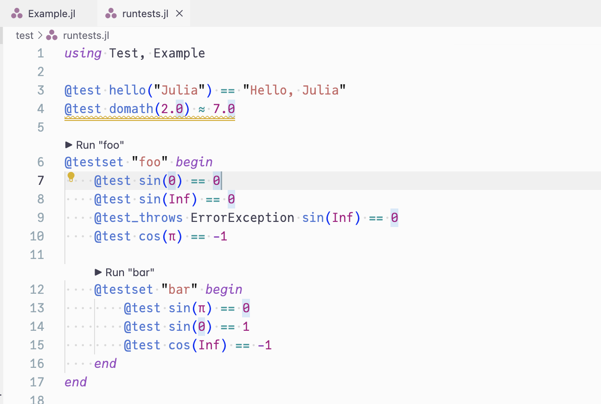
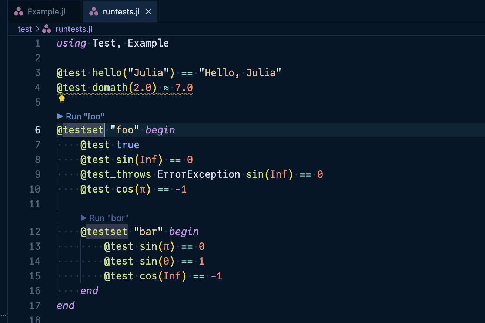
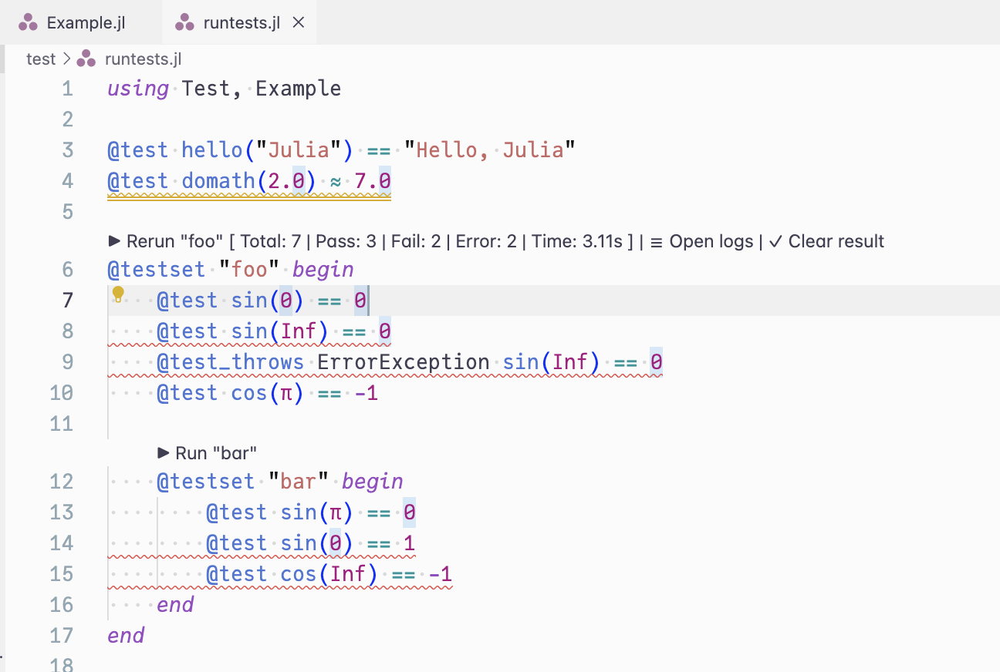
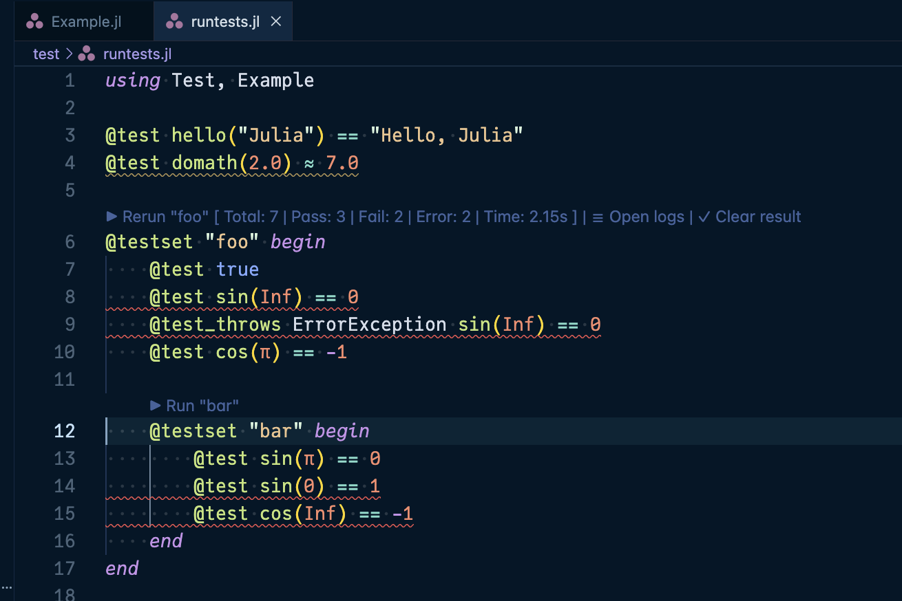
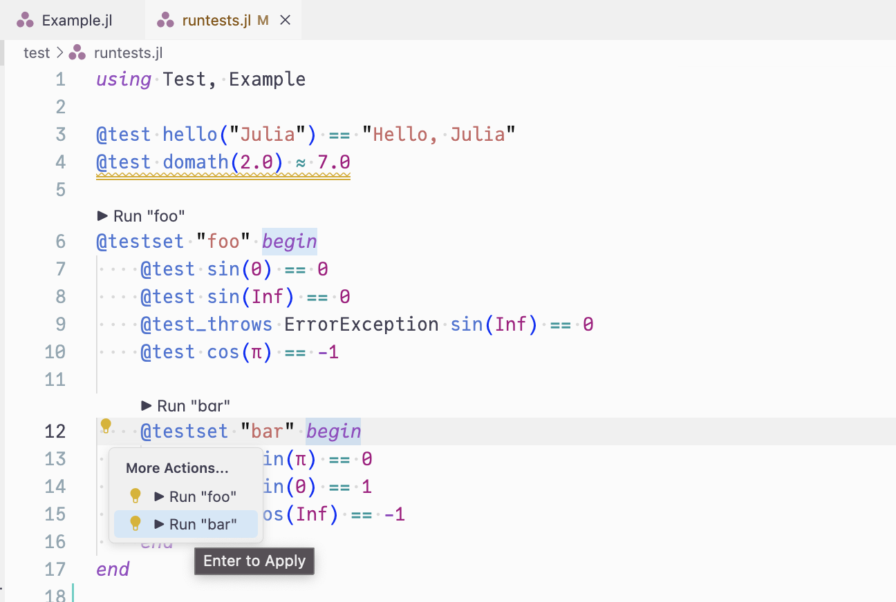
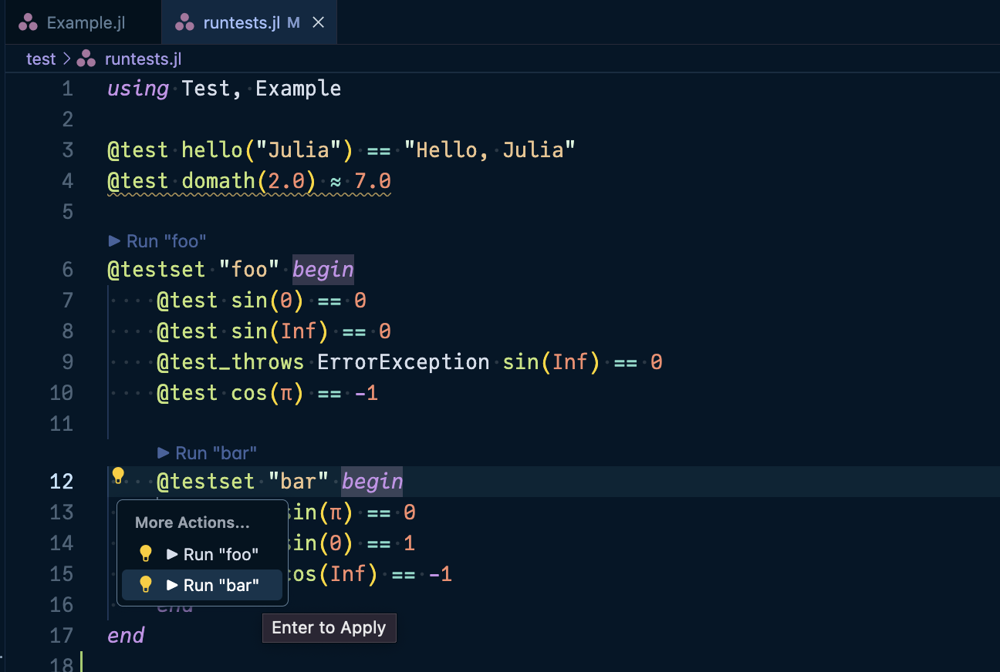
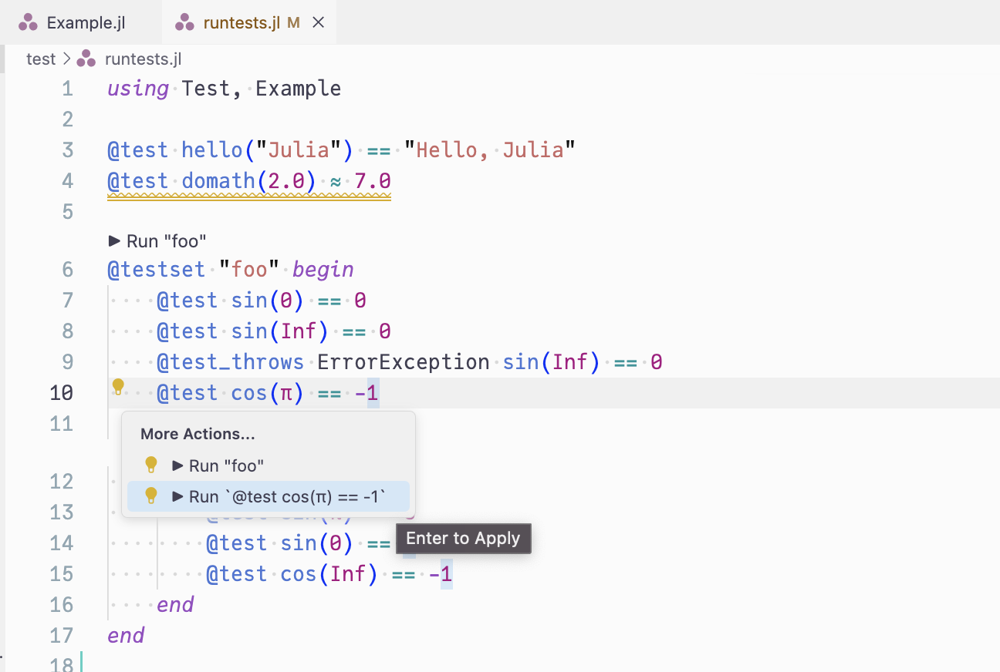
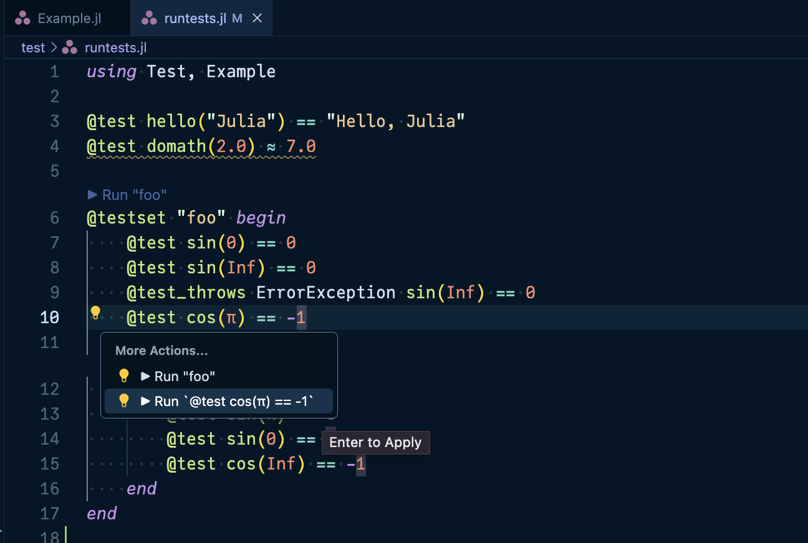
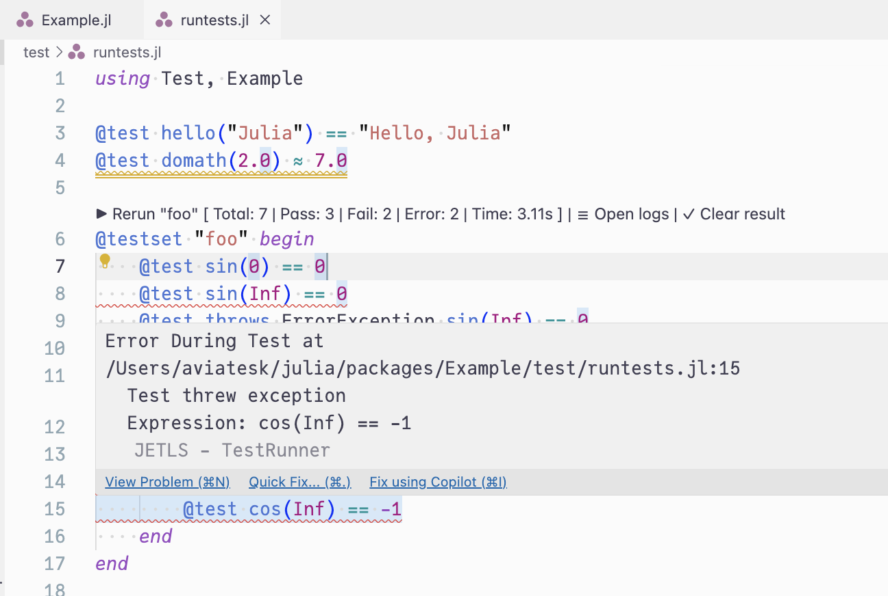
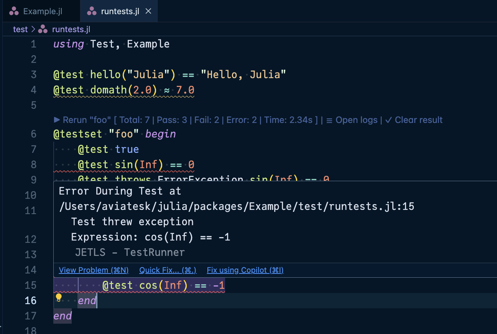

# [TestRunner integration](@id testrunner)

JETLS integrates with [TestRunner.jl](https://github.com/aviatesk/TestRunner.jl)
to provide an enhanced testing experience directly within your editor. This
feature allows you to run individual `@testset` blocks directly from your
development environment.

## [Prerequisites](@id testrunner/prerequisites)

To use this feature, you need to install the `testrunner` executable:
```bash
julia -e 'using Pkg; Pkg.Apps.add(; url="https://github.com/aviatesk/TestRunner.jl", rev="release")'
```

Note that you need to manually make `~/.julia/bin` available on the `PATH`
environment for the `testrunner` executable to be accessible.
See <https://pkgdocs.julialang.org/dev/apps/> for the details.

## [Features](@id testrunner/features)

### [Code lens](@id testrunner/features/code-lens)

When you open a Julia file containing `@testset` blocks, JETLS displays
interactive code lenses above each `@testset`:

> - `▶ Run "testset_name"`: Run the testset for the first time
> ```@raw html
> <div class="display-light-only">
> ```
> 
> ```@raw html
> </div>
> <div class="display-dark-only">
> ```
> 
> ```@raw html
> </div>
> ```

After running tests, the code lens is refreshed as follows:
> - `▶ Rerun "testset_name" [summary]`: Re-run a testset that has previous results
> - `☰ Open logs`: View the detailed test output in a new editor tab
> - `✓ Clear result`: Remove the test results and inline diagnostics
> ```@raw html
> <div class="display-light-only">
> ```
> 
> ```@raw html
> </div>
> <div class="display-dark-only">
> ```
> 
> ```@raw html
> </div>
> ```

On editors that support [`workspace/textDocumentContent`](https://microsoft.github.io/language-server-protocol/specifications/lsp/3.18/specification/#workspace_textDocumentContent)
(an LSP 3.18 feature), the logs open in a read-only virtual document that
refreshes in place when you re-run the same testset, so you don't need to reopen
it. On other editors, the logs open as a temporary file instead.

### [Code actions](@id testrunner/features/code-actions)

You can trigger test runs via "code actions" that are explicitly requested by the user:

> - Inside a `@testset` block: Run the entire testset
> ```@raw html
> <div class="display-light-only">
> ```
> 
> ```@raw html
> </div>
> <div class="display-dark-only">
> ```
> 
> ```@raw html
> </div>
> ```

> - On an individual `@test` macro: Run just that specific test case
> ```@raw html
> <div class="display-light-only">
> ```
> 
> ```@raw html
> </div>
> <div class="display-dark-only">
> ```
> 
> ```@raw html
> </div>
> ```

Note that when running individual `@test` cases, the error results are displayed
as temporary diagnostics for 10 seconds. Click `☰ Open logs` button in the
pop up message to view detailed error messages that persist.

### [Test diagnostics](@id testrunner/features/test-diagnostics)

Failed tests are displayed as diagnostics (red squiggly lines) at the exact
lines where the failures occurred, making it easy to identify and fix issues:
> ```@raw html
> <div class="display-light-only">
> ```
> 
> ```@raw html
> </div>
> <div class="display-dark-only">
> ```
> 
> ```@raw html
> </div>
> ```

### [Progress notifications](@id testrunner/features/progress-notifications)

For clients that support work done progress, JETLS shows progress notifications
while tests are running, keeping you informed about long-running test suites.

## [Supported patterns](@id testrunner/supported-patterns)

The TestRunner integration supports:

1. Named `@testset` blocks (via code lens or code actions):
   ```julia
   using Test

   # supported: named `@testset`
   @testset "foo" begin
     @test sin(0) == 0
     @test sin(Inf) == 0
     @test_throws ErrorException sin(Inf) == 0
     @test cos(π) == -1

       # supported: nested named `@testset`
       @testset "bar" begin
         @test sin(π) == 0
         @test sin(0) == 1
         @test cos(Inf) == -1
       end
   end

   # unsupported: `@testset` inside function definition
   function test_func1()
     @testset "inside function" begin
       @test true
     end
   end

   # supported: this pattern is fine
   function test_func2()
     @testset "inside function" begin
       @test true
     end
   end
   @testset "test_func2" test_func2()
   ```

2. Individual `@test` macros (via code actions only):
   ```julia
   # Run individual tests directly
   @test 1 + 1 == 2
   @test sqrt(4) ≈ 2.0

   # Also works inside testsets
   @testset "math tests" begin
     @test sin(0) == 0  # Can run just this test
     @test cos(π) == -1  # Or just this one
   end

   # Multi-line `@test` expressions are just fine
   @test begin
     x = complex_calculation()
     validate(x)
   end

   # Other Test.jl macros are supported too
   @test_throws DomainErrors sin(Inf)
   ```

See the [TestRunner.jl README](https://github.com/aviatesk/TestRunner.jl) for more details.

## [Troubleshooting](@id testrunner/troubleshooting)

If you see an error about `testrunner` not being found:

1. Ensure you've installed TestRunner.jl as described above
2. Check that `testrunner` is in your system `PATH` by running
   `which testrunner`: otherwise you may need to add `~/.julia/bin` to `PATH`
3. Restart your editor to ensure it picks up the updated `PATH`

Starting with releases on or after 2026-05-06, test execution streams the
current editor buffer to `testrunner` over stdin, so saving the file is not
required and unsaved edits run as-is — including buffers (`untitled:` for
VSCode / `buffer:` for Sublime Text) that have never been saved to disk,
where relative `include` calls resolve from the workspace root.

This needs a `testrunner` CLI new enough to recognize the `--read-stdin`
flag — if tests fail to start with an "Unknown option" error, reinstall
`testrunner` (see [Prerequisites](@ref testrunner/prerequisites)) and confirm
that `testrunner --help` lists `--read-stdin` under `Options:`.
