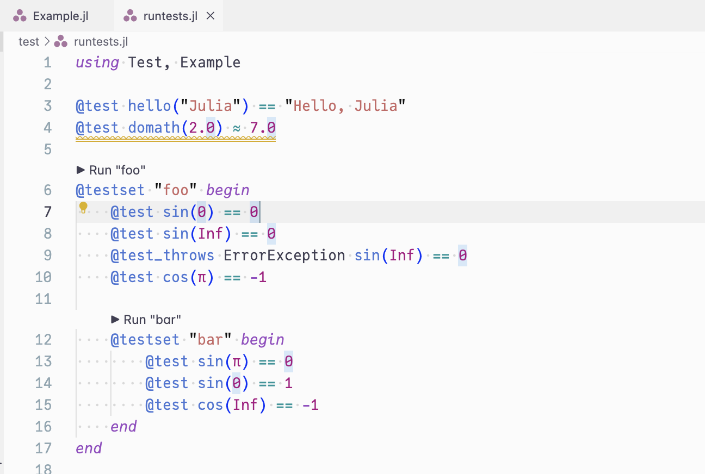
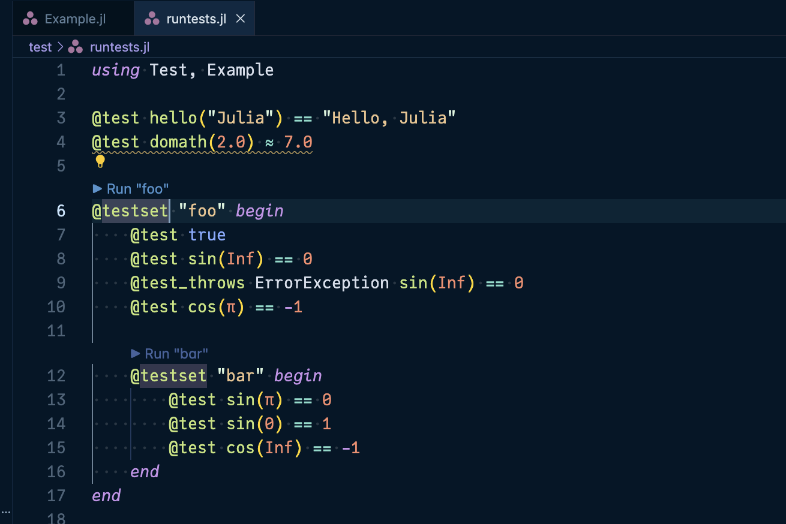
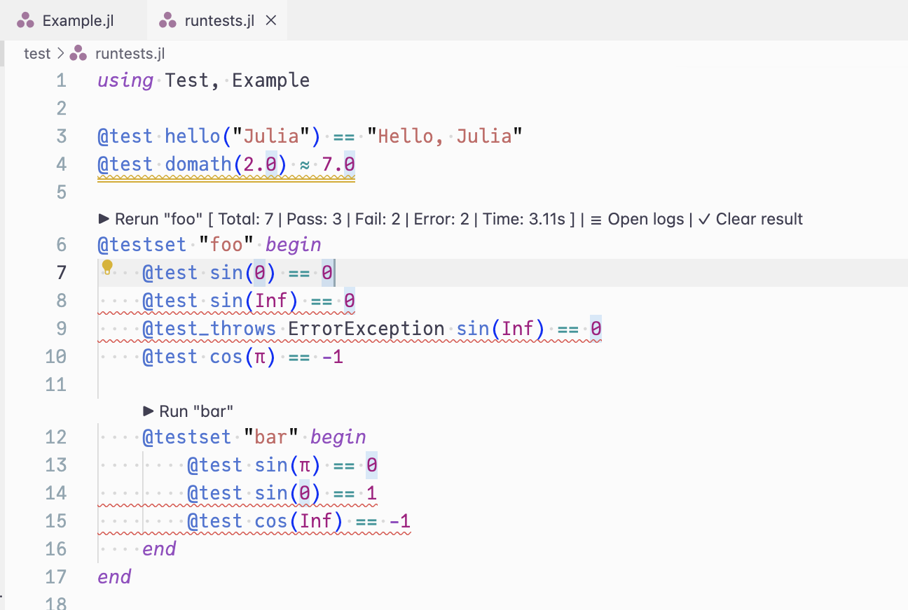
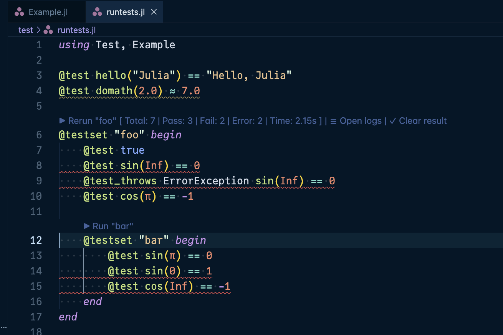
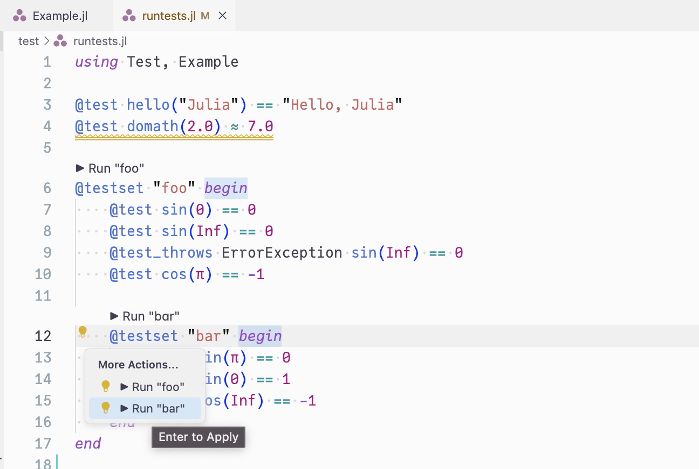
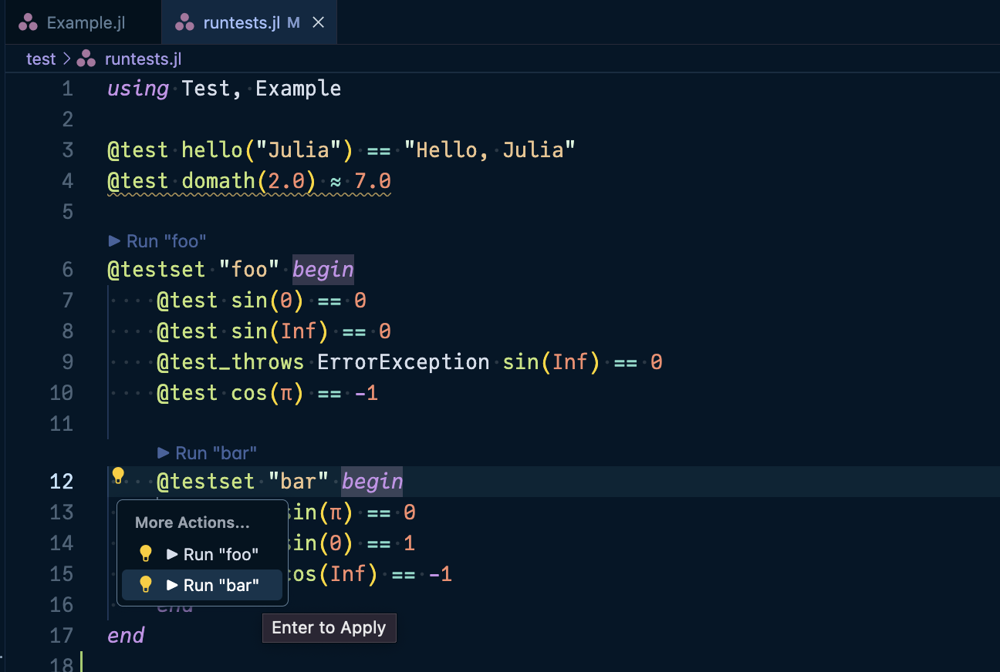
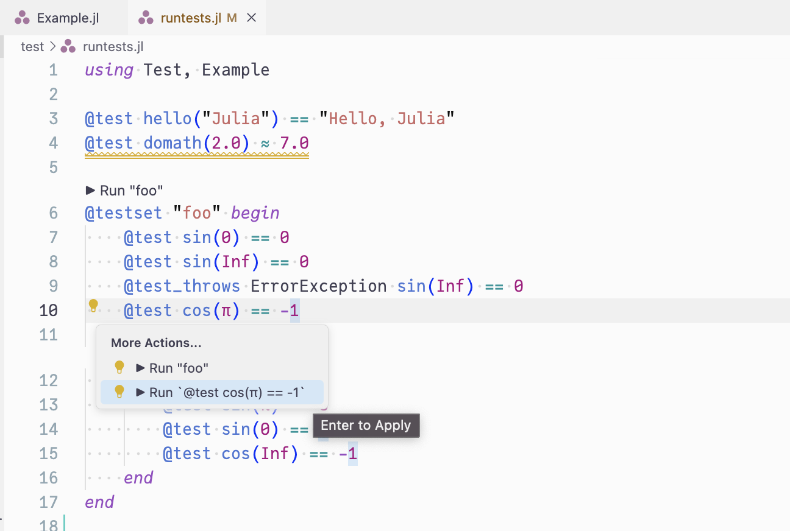
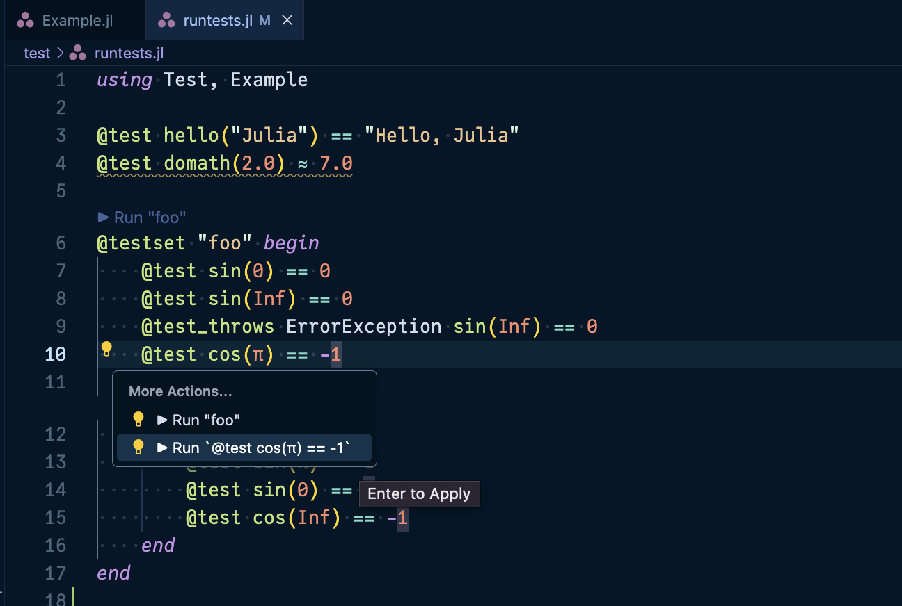
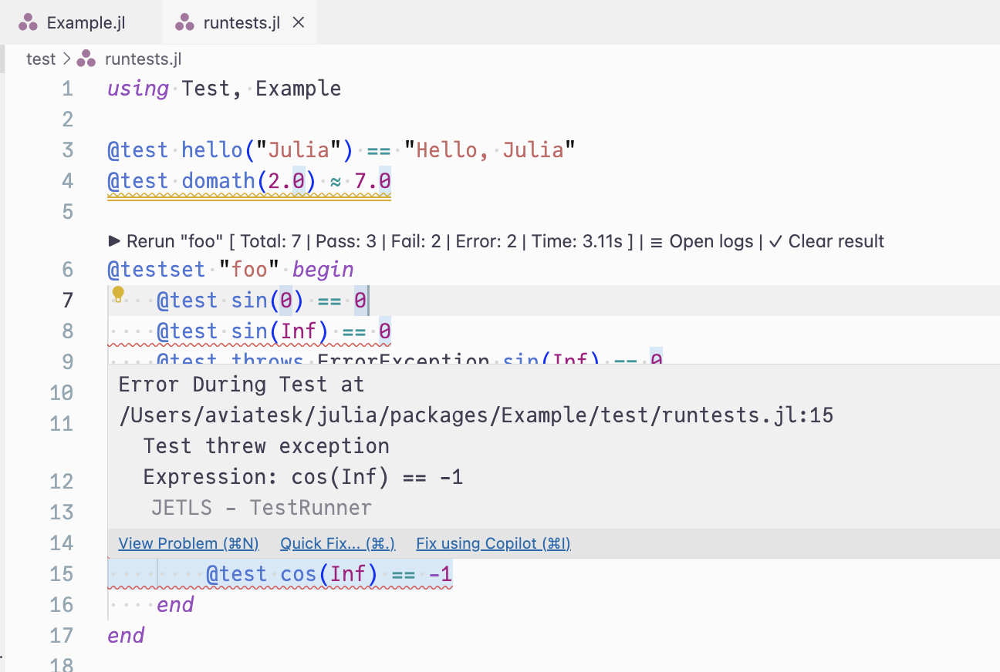
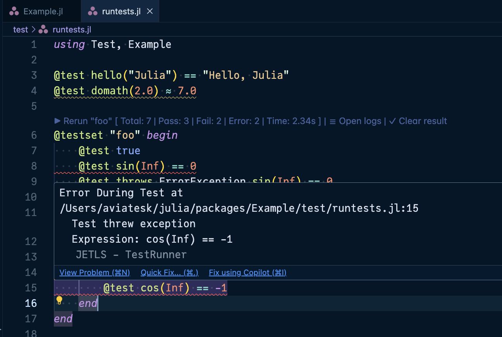

# [TestRunner integration](@id testrunner)

JETLS integrates with [TestRunner.jl](https://github.com/aviatesk/TestRunner.jl)
to provide an enhanced testing experience directly within your editor. This
feature allows you to run individual `@testset` blocks directly from your
development environment.

TestRunner.jl is bundled with JETLS, so no additional installation is required.
Tests run in a separate process with the Julia running JETLS by default; see
[`[testrunner]`](@ref config/testrunner) to run them with another Julia or to
pass additional options to Julia.

Test execution sends the current editor buffer to TestRunner.jl, so saving the
file is not required and unsaved edits run as-is, including buffers that have
never been saved to disk (`untitled:` for VSCode / `buffer:` for Sublime Text),
where relative `include` calls resolve from the workspace root.

## [Features](@id testrunner/features)

### [Code lens](@id testrunner/features/code-lens)

When you open a Julia file containing `@testset` blocks, JETLS displays
interactive code lenses above each `@testset`:

> - `▶ Run "testset_name"`: Run the testset for the first time
> ```@raw html
> <div class="display-light-only">
> ```
> 
> ```@raw html
> </div>
> <div class="display-dark-only">
> ```
> 
> ```@raw html
> </div>
> ```

After running tests, the code lens is refreshed as follows:
> - `▶ Rerun "testset_name" [summary]`: Re-run a testset that has previous results
> - `☰ Open logs`: View the detailed test output in a new editor tab
> - `✓ Clear result`: Remove the test results and inline diagnostics
> ```@raw html
> <div class="display-light-only">
> ```
> 
> ```@raw html
> </div>
> <div class="display-dark-only">
> ```
> 
> ```@raw html
> </div>
> ```

On editors that support [`workspace/textDocumentContent`](https://microsoft.github.io/language-server-protocol/specifications/lsp/3.18/specification/#workspace_textDocumentContent)
(an LSP 3.18 feature), the logs open in a read-only virtual document that
refreshes in place when you re-run the same testset, so you don't need to reopen
it. On other editors, the logs open as a temporary file instead.

### [Code actions](@id testrunner/features/code-actions)

You can trigger test runs via "code actions" that are explicitly requested by the user:

> - Inside a `@testset` block: Run the entire testset
> ```@raw html
> <div class="display-light-only">
> ```
> 
> ```@raw html
> </div>
> <div class="display-dark-only">
> ```
> 
> ```@raw html
> </div>
> ```

> - On an individual `@test` macro: Run just that specific test case
> ```@raw html
> <div class="display-light-only">
> ```
> 
> ```@raw html
> </div>
> <div class="display-dark-only">
> ```
> 
> ```@raw html
> </div>
> ```

Note that when running individual `@test` cases, the error results are displayed
as temporary diagnostics for 10 seconds. Click `☰ Open logs` button in the
pop up message to view detailed error messages that persist.

### [Test diagnostics](@id testrunner/features/test-diagnostics)

Failed tests are displayed as diagnostics (red squiggly lines) at the exact
lines where the failures occurred, making it easy to identify and fix issues:
> ```@raw html
> <div class="display-light-only">
> ```
> 
> ```@raw html
> </div>
> <div class="display-dark-only">
> ```
> 
> ```@raw html
> </div>
> ```

### [Progress notifications](@id testrunner/features/progress-notifications)

For clients that support work done progress, JETLS shows progress notifications
while tests are running, keeping you informed about long-running test suites.

## [Supported patterns](@id testrunner/supported-patterns)

The TestRunner integration supports:

1. Named `@testset` blocks (via code lens or code actions):
   ```julia
   using Test

   # supported: named `@testset`
   @testset "foo" begin
     @test sin(0) == 0
     @test sin(Inf) == 0
     @test_throws ErrorException sin(Inf) == 0
     @test cos(π) == -1

       # supported: nested named `@testset`
       @testset "bar" begin
         @test sin(π) == 0
         @test sin(0) == 1
         @test cos(Inf) == -1
       end
   end

   # unsupported: `@testset` inside function definition
   function test_func1()
     @testset "inside function" begin
       @test true
     end
   end

   # supported: this pattern is fine
   function test_func2()
     @testset "inside function" begin
       @test true
     end
   end
   @testset "test_func2" test_func2()
   ```

2. Individual `@test` macros (via code actions only):
   ```julia
   # Run individual tests directly
   @test 1 + 1 == 2
   @test sqrt(4) ≈ 2.0

   # Also works inside testsets
   @testset "math tests" begin
     @test sin(0) == 0  # Can run just this test
     @test cos(π) == -1  # Or just this one
   end

   # Multi-line `@test` expressions are just fine
   @test begin
     x = complex_calculation()
     validate(x)
   end

   # Other Test.jl macros are supported too
   @test_throws DomainError sin(Inf)
   ```

## [Test selection](@id testrunner/test-selection)

When you run a testset or test, TestRunner.jl skips the other tests in the
file, including those nested in other code such as `let` blocks, along with
the code using their results. _All the other code runs_, both at the top level
and in the testsets enclosing the selected one, so that the definitions and
setup the selected tests rely on are available. For example, running `"b"` in
the following code runs `setup()` and `"b"`, and skips `"a"`, `"c"` and
`report(result)`:
```julia
@testset "outer" begin
    setup()
    @testset "a" begin
        @test f() == 1
    end
    @testset "b" begin
        @test g() == 2
    end
    result = @testset "c" begin
        @test h() == 3
    end
    report(result)
end
```

Files `include`d by the code that runs are executed without their tests, except
files `include`d by the selected code, which run with all their tests. For
example, running `"b"` in the following code loads `helpers.jl` without running
its tests, runs all of `test_b.jl` including its tests, and does not run
`test_a.jl` at all:
```julia
include("helpers.jl")

@testset "a" include("test_a.jl")
@testset "b" include("test_b.jl")
```

### [Limitations and workarounds](@id testrunner/test-selection/limitations)

1. Tests in functions called by the code that runs always run, since
   TestRunner.jl does not look into function calls. This includes functions
   called with `do` blocks:
   ```julia
   function test_parse()
       @test parse(Int, "1") == 1
   end
   test_parse()  # its test always runs

   mktempdir() do dir
       @testset "tempdir" begin  # always runs
           @test isdir(dir)
       end
   end
   ```
   Call such functions from a testset, so that they run only when the testset
   is selected (see also
   [Supported patterns](@ref testrunner/supported-patterns)):
   ```julia
   @testset "parse" test_parse()

   @testset "tempdir" begin
       mktempdir() do dir
           @test isdir(dir)
       end
   end
   ```

2. Setup code in the testsets enclosing the selected one runs even when the
   selected tests do not use it:
   ```julia
   @testset "outer" begin
       data = load_large_data()  # runs even when running only "small"
       @testset "large" begin
           @test process(data) == expected
       end
       @testset "small" begin
           @test process([1, 2]) == [2, 4]
       end
   end
   ```
   Move expensive setup into the testset that uses it:
   ```julia
   @testset "outer" begin
       @testset "large" begin
           data = load_large_data()
           @test process(data) == expected
       end
       @testset "small" begin
           @test process([1, 2]) == [2, 4]
       end
   end
   ```

3. Multiple tests on the same line cannot be selected individually:
   ```julia
   @testset "math" begin
       @test f(1) == 1; @test f(2) == 2  # running either runs both
   end
   ```
   Write each `@test` on its own line:
   ```julia
   @testset "math" begin
       @test f(1) == 1
       @test f(2) == 2
   end
   ```

See the [How it works](https://github.com/aviatesk/TestRunner.jl#how-it-works)
and [Limitations](https://github.com/aviatesk/TestRunner.jl#limitations)
sections of the TestRunner.jl README for more details.

## [Troubleshooting](@id testrunner/troubleshooting)

If tests fail to start with an error about the Julia executable not being
found, check the Julia selected by [`[testrunner] env`](@ref config/testrunner/env):
`JULIA_APPS_JULIA_CMD` needs to point to an existing Julia executable, and
`JULIAUP_CHANNEL` needs the `julia` launcher of
[juliaup](https://github.com/JuliaLang/juliaup) to be available on the `PATH`
of the JETLS process.

If `JULIAUP_CHANNEL` seems to have no effect, the `julia` command on the `PATH`
of the JETLS process is probably not the juliaup launcher, in which case the
channel is ignored. Note that this `PATH` can differ from the one of your
shell, e.g. when the editor is not launched from the shell.
